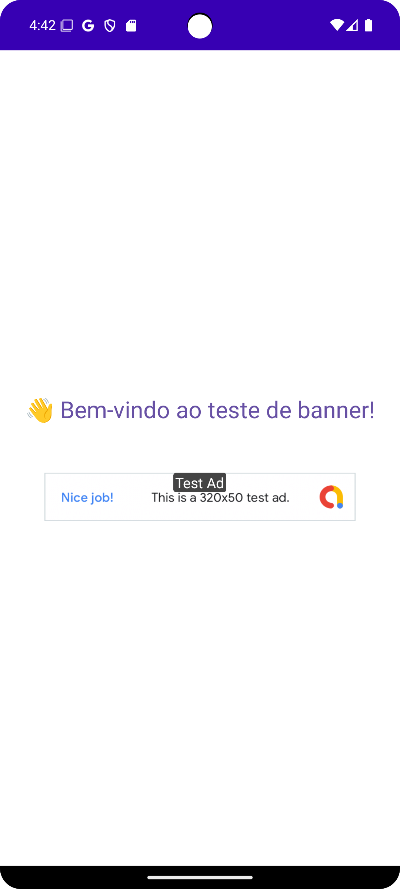
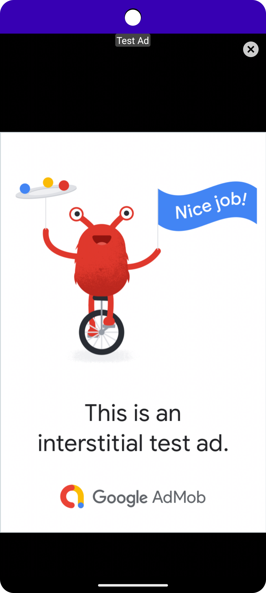

Aqui está um `README.md` automático, pronto para ser incluído no seu repositório Git. Ele documenta a estrutura modular, uso da lib, tipos de anúncios suportados e como configurar o app de teste.

---

```markdown
# 📢 AdMob Modular Demo

Projeto modular Android/Kotlin com Jetpack Compose para testar integração com Google AdMob utilizando Banner, Interstitial e Rewarded Ads.

## 📦 Estrutura

```

root/
├── admoblib/      # Módulo da biblioteca de anúncios (reutilizável)
└── app/           # Aplicativo de teste da biblioteca

````

---

## 🎯 Objetivo

Este projeto demonstra a implementação e uso de uma biblioteca modular para anúncios AdMob em um app Android moderno usando Jetpack Compose.

Suporte incluído:
- ✅ Banner Ads
- ✅ Interstitial Ads
- ✅ Rewarded Ads

---

## ⚙️ Configuração

### 1. Clonar o repositório

```bash
git clone https://github.com/seu-usuario/admob-demo.git
cd admob-demo
````

### 2. `local.properties`

Crie um arquivo `local.properties` na raiz com sua chave do AdMob:

```
ADMOB_APP_ID=ca-app-pub-xxxxxxxxxxxxxxxx~yyyyyyyyyy
ADMOB_BANNER_ID=ca-app-pub-xxxxxxxxxxxxxxxx~yyyyyyyyyy
ADMOB_INTERSTITIAL_ID=ca-app-pub-xxxxxxxxxxxxxxxx~yyyyyyyyyy
ADMOB_REWARDED_ID=ca-app-pub-xxxxxxxxxxxxxxxx~yyyyyyyyyy
```

> 🔒 Esse arquivo está no `.gitignore` e **não deve ser versionado**.

---

## 🧩 Uso da Library

### Componente Principal

---

## 📱 Screenshots

| Banner | Interstitial | Rewarded |
|--------|--------------|----------|
|  |  |  |


```kotlin
@Composable
fun AdBanner(
    adUnitId: String,
    adType: AdType,
    onEvent: (AdEvent) -> Unit
)
```

Na aplicacao, fará a initialization startKoin dos modules.
```kotlin
class AdMobApplication : Application() {
    override fun onCreate() {
        super.onCreate()

        startKoin {
            androidContext(this@AdMobApplication)
            modules(AdMob.initKoinModules())
        }
        AdMob.initializeSdk(this)
    }
}
```


```kotlin
val adManager: IAdMobManager = getKoin().get()
```

A partir daqui voce já consegue utilizar em seu contexto compose tendo customizado eventos, tipos com AdType e inserindo o seu adUnitId
Simples e Prático.

```kotlin
adManager.init(
    adUnitId = "addYourADunitIdHere",
    adType = AdType.Banner,
    modifier = Modifier,
    onEvent = { event ->
        when (event) {
            is AdEvent.Loading -> Log.d("AdBanner", "Carregando...")
            is AdEvent.Loaded -> {
                Log.d("AdBanner", "Anúncio carregado")
            }
            is AdEvent.Failed -> {
                Log.e("AdBanner", "Erro: ${event.message}")
            }
            AdEvent.Closed -> {
                Log.d("AdBanner", "Fechado")
            }
            AdEvent.Opened -> {
                Log.d("AdBanner", "Aberto")
            }
            else -> {}
        }
    }
)
```


### Tipos de Anúncio

```kotlin
enum class AdType {
    Banner,
    Interstitial,
    Rewarded
}
```

### Eventos Suportados

```kotlin
sealed class AdEvent {
    data object Loading : AdEvent()
    data object Loaded : AdEvent()
    data class Failed(val message: String) : AdEvent()
}
```

---

## 🧪 App de Teste

O módulo `app/` contém uma tela Compose com o componente `AdBanner` em funcionamento.

### Exemplo:

```kotlin
AdBanner(
    adUnitId = BuildConfig.ADMOB_REWARDED_ID,
    adType = AdType.Rewarded,
    onEvent = { event ->
        when (event) {
            AdEvent.Loading -> Log.d("AdBanner", "Carregando...")
            AdEvent.Loaded -> Log.d("AdBanner", "Carregado")
            is AdEvent.Failed -> Log.e("AdBanner", "Erro: ${event.message}")
        }
    }
)
```

---

## ✅ Requisitos

* Android Studio Giraffe ou superior
* Kotlin 2.0.0
* Compose Compiler compatível com sua versão do Kotlin
* Conta AdMob configurada com unidades de teste ou reais

---

## 📌 TODOs (Futuros)

* [ ] Eventos: `Opened`, `Closed`, `RewardEarned`
* [ ] Suporte a Preview em Compose
* [ ] Testes unitários no ViewModel
* [ ] Publicar lib em Maven interno
* [ ] Logging interno + fallback
* [ ] Adicionar Testes instrumentados a lib
* [ ] Mover variáveis para secrets

---

## 🧑‍💻 Autor

Desenvolvido por \[Maxwell Bezerra Chaves]
🔗 [LinkedIn](https://linkedin.com/in/https://www.linkedin.com/in/maxwellchavesdev/)

---

## 📄 Licença

MIT License. Veja o arquivo [LICENSE](./LICENSE) para mais detalhes.
